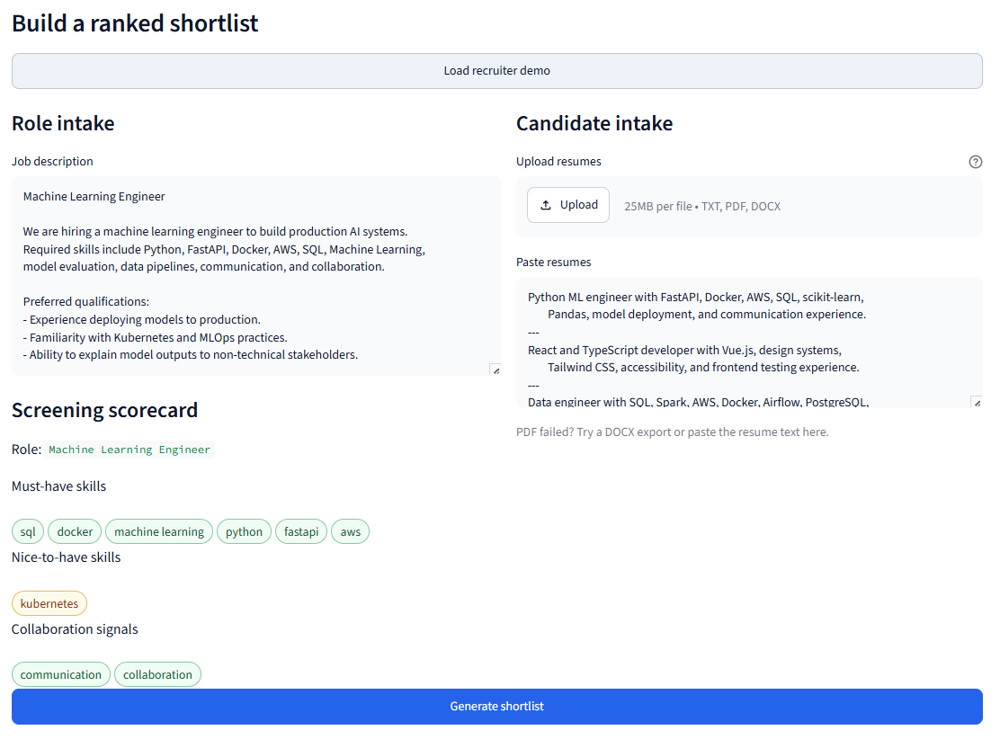
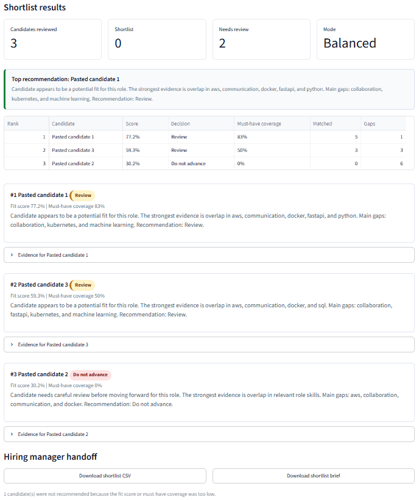
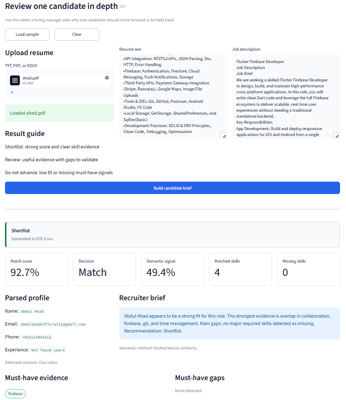
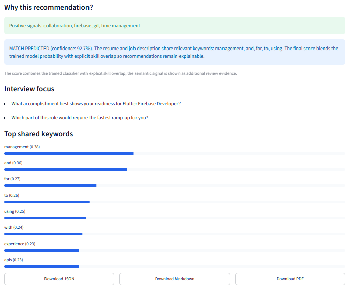
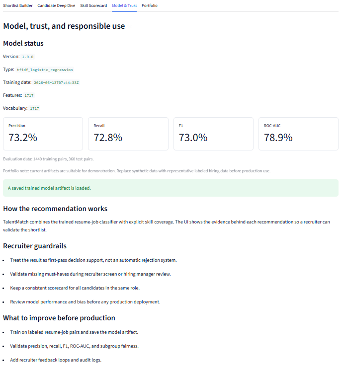

# AI-Powered Resume Screening and Job Matching System

**TalentMatch AI** is a recruiter-focused resume screening and job matching app built by **Abdul Ahad**.

- Email: `abdulahad.de@outlook.com`
- GitHub: [`aahad699`](https://github.com/aahad699)

## Project Description

TalentMatch AI helps recruiters convert a job description and a group of resumes into an explainable shortlist. Instead of only returning a black-box score, it shows must-have skill coverage, nice-to-have evidence, missing requirements, candidate concerns, and interview questions to validate gaps.

The project combines a Streamlit recruiter interface with a FastAPI backend and an interpretable machine learning pipeline using TF-IDF, Logistic Regression, skill extraction, and semantic similarity signals.

## Problem

Recruiters often screen many resumes manually. This creates several problems:

- Candidate comparison is slow and inconsistent.
- Important job requirements can be missed during manual review.
- Shortlist decisions are hard to explain to hiring managers.
- Screening tools often feel like black boxes and do not show clear evidence.

## Solution

TalentMatch AI provides a recruiter workflow:

1. Paste a job description.
2. Upload or paste multiple resumes.
3. Extract role requirements and skill signals.
4. Rank candidates using an AI-assisted fit score.
5. Show must-have matches, missing skills, concerns, and interview focus.
6. Export a shortlist report for hiring manager review.

The goal is not to replace recruiter judgment. The app is designed as first-pass decision support that makes screening faster, more consistent, and more explainable.

## Screenshots

### Shortlist Builder



### Shortlist Results



### Candidate Evidence Card



### Candidate Deep Dive



### Model and Trust



## Key Features

- Recruiter-first Shortlist Builder
- Batch resume ranking against one job description
- Candidate cards with shortlist, review, and do-not-advance decisions
- Must-have and nice-to-have skill scorecards
- Matched skills, missing skills, concerns, and interview prompts
- Single-candidate deep dive
- TXT, PDF, and DOCX resume upload support
- Friendly handling for corrupted or unsupported PDFs
- CSV, Markdown, JSON, and PDF exports
- FastAPI backend with interactive API documentation
- Model transparency panel with metrics and responsible-use notes

## Tech Stack

| Layer | Tools |
| --- | --- |
| Frontend | Streamlit |
| Backend API | FastAPI, Uvicorn |
| Machine Learning | scikit-learn, TF-IDF, Logistic Regression |
| NLP and Matching | Skill extraction, fuzzy matching, semantic similarity fallback |
| File Parsing | pypdf, python-docx |
| Model Storage | joblib |

## Model Notes

The included model artifact is a portfolio demonstration model trained on synthetic resume-job pairs.

Current saved model metadata:

- Model type: TF-IDF + Logistic Regression
- Training pairs: 1,440
- Test pairs: 360
- Precision: 73.18%
- Recall: 72.78%
- F1 score: 72.98%
- ROC-AUC: 78.94%

For production use, the model should be retrained and validated on representative labeled hiring data, with fairness checks and recruiter feedback loops.

## Run Locally

### 1. Create and activate a virtual environment

```powershell
py -m venv .venv
.\.venv\Scripts\Activate.ps1
```

### 2. Install dependencies

```powershell
pip install -r requirements.txt
```

### 3. Start the app

```powershell
.\run_app.ps1
```

Open:

- Streamlit UI: http://127.0.0.1:8501
- FastAPI docs: http://127.0.0.1:8000/docs

## Manual Commands

Start the API:

```powershell
.\.venv\Scripts\python.exe -m uvicorn project.main:app --host 127.0.0.1 --port 8000
```

Start the Streamlit app:

```powershell
.\.venv\Scripts\python.exe -m streamlit run project\app.py --server.port 8501 --server.address 127.0.0.1
```

## Project Structure

```text
.
├── project/
│   ├── app.py                 # Streamlit recruiter UI
│   ├── main.py                # FastAPI backend
│   ├── inference.py           # Model loading and prediction
│   ├── skill_extraction.py    # Skill extraction and matching
│   ├── text_extraction.py     # TXT/PDF/DOCX parsing
│   ├── resume_parser.py       # Candidate profile parsing
│   ├── reporting.py           # CSV/Markdown/JSON/PDF exports
│   └── train_model.py         # Model training entrypoint
├── models/1.0.0/
│   ├── pipeline.joblib
│   └── metadata.json
├── images/
│   └── demo screenshots
├── notebooks/
├── requirements.txt
├── requirements-ml.txt
├── run_app.ps1
└── README.md
```

## API Endpoints

- `GET /health` - service and model health
- `POST /match` - match one resume to one job description
- `POST /batch-match` - rank multiple resumes for one job
- `POST /extract-skills` - extract technical and soft skills from text

## Portfolio Resume Bullet

```text
Built TalentMatch AI, an AI-powered resume screening and job matching system using Python, Streamlit, FastAPI, NLP skill extraction, TF-IDF + Logistic Regression, explainable shortlist ranking, and exportable recruiter reports.
```

